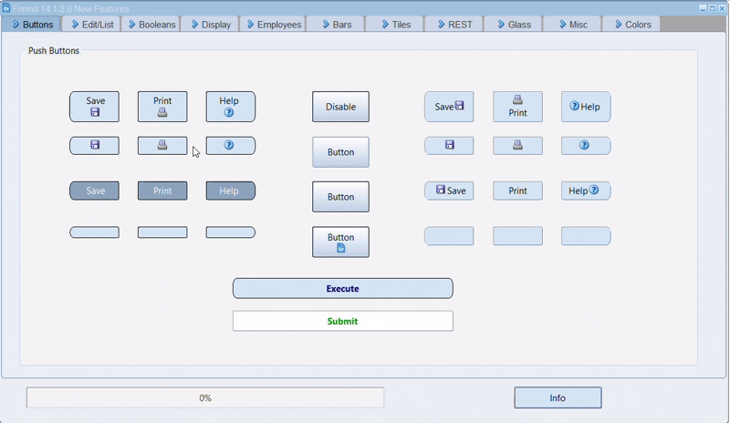
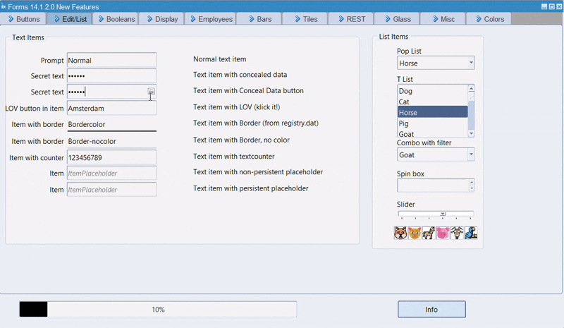
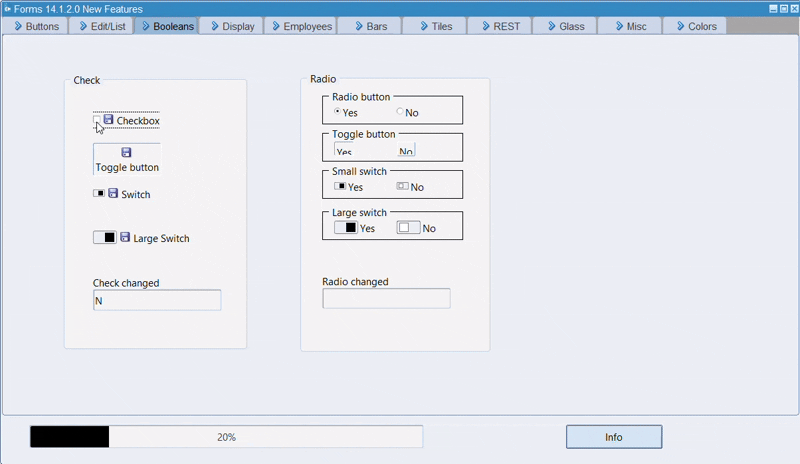
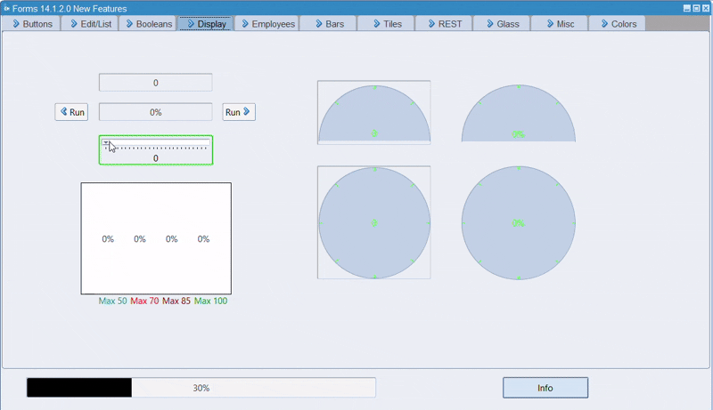
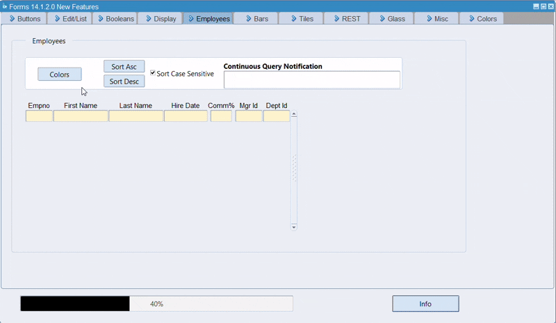
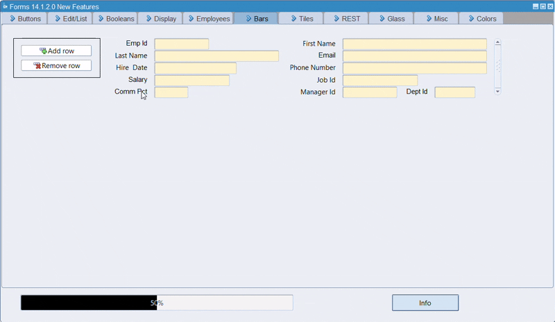
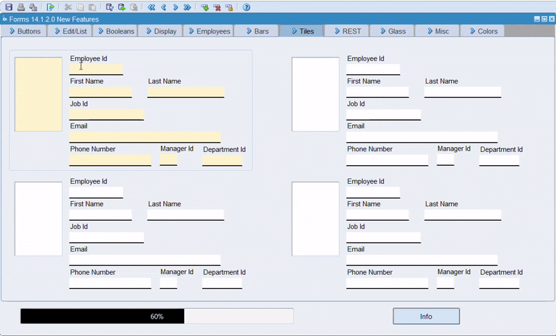
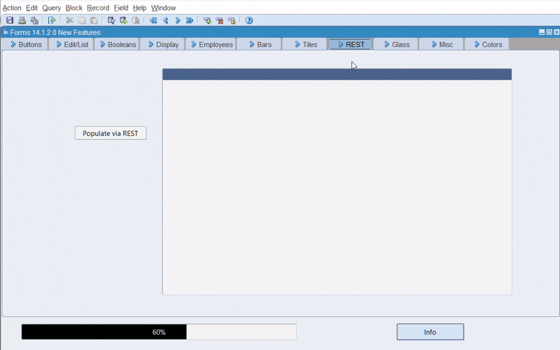
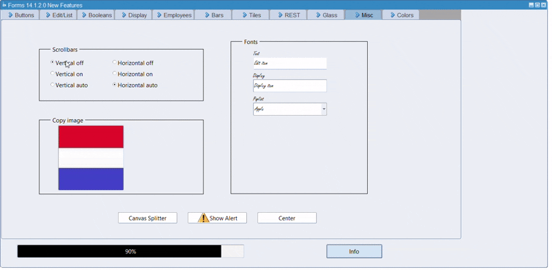
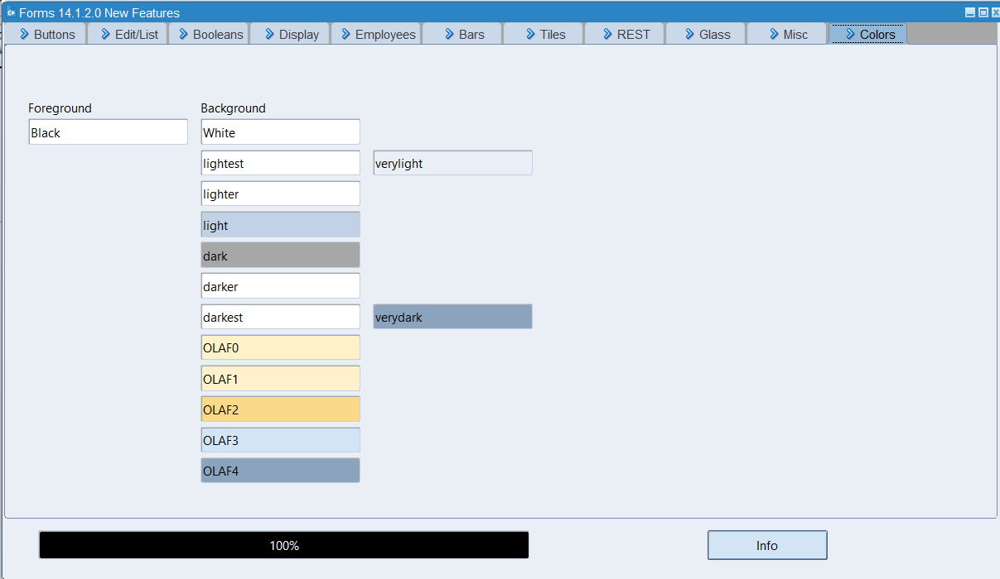

# Oracle Froms 14c New Features
 
On 20 Decenber 2024 Michael Ferrante announced Oracle Forms and Reports 14c (14.1.2.0). For this release I "waited" for a long time, and was very eager to explore all the new features I saw in a demo at the DOAG 2024. Unfortunately, Oracle does not share any demo-code, so I had to do this for myself.
Why not share this with the rest of the community? I asked Michael whether he had problems when I published a demo-form that showed a lot of new features, in more or less the same way as he did. No problems, thanks Michael! So here it is!

A lot of these features are described in https://www.oracle.com/a/otn/docs/oracleforms-1412-newfeatures.pdf. In this readme I will show screenshots of the demo-form, with a textual reference to described features (since it won't be easy for everybody to get a forms-environment up and running).
In a final chapter I'll describe some settings relevant to get this demo started.

# Push Buttons

Runtime Features > User Interface > Push Buttons

## Edit/List

Runtime Features > User Interface > Text Items
Runtime Features > User Interface > List Items

Booleans

Runtime Features > User Interface > Boolean Items

Display

Runtime Features > User Interface > Display Items

Employees

Runtime Features > User Interface > Multi Record Blocks
Runtime Features > Data Access, Monitoring and Manipulation > Continuous Query Notification

Bars

Runtime Features > User Interface > Multi Record Blocks > Dynamic Size Block

Tiles

Runtime Features > User Interface > Multi Record Blocks > Tiles

REST-services

Runtime Features > Data Access, Monitoring and Manipulation > REST

Glass

Runtime Features > User Interface > Fill Pattern Property

Misc

Runtime Features > User Interface > Window > Canvas Window Scrollbars
Runtime Features > Miscellaneous Runtime Features > Image Copy
Runtime Features > User Interface > Canvasses > Stacked Canvas Splitter
Runtime Features > User Interface > Alerts

Colors:

Just a tab to test the predefined colors

