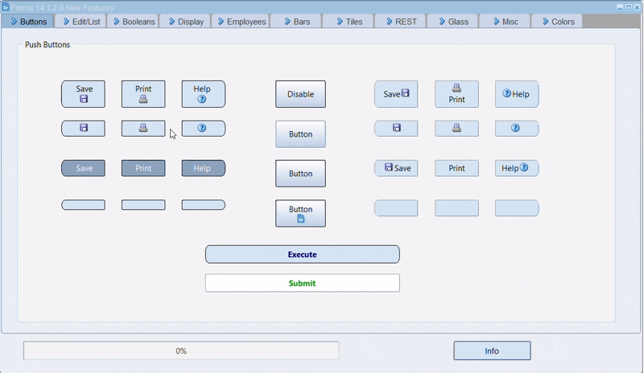

# Oracle Froms 14c New Features
 
On 20 Decenber 2024 Michael Ferrante announced Oracle Forms and Reports 14c (14.1.2.0). This is the release I "waited" for a long time, and was very eager to explore all the new features I saw in a demo at the DOAG 2024. Unfortunately, Oracle does not share any demo-code, so I had to do this for myself.
Why not share this with the rest of the community? I asked Michael whether he had problems when I published a demo-form that showed a lot of new features, in more or less the same way as he did. No problems, thanks Michael, so here it is!

A lot of these features are described in https://www.oracle.com/a/otn/docs/oracleforms-1412-newfeatures.pdf. In this readme I will show screenshots of the demo-form, with a textual reference to described features (since it won't be easy for everybody to get a forms-environment up and running).
In a final chapter I'll describe some settings relevant to get this demo started.

test:

test1a
.. raw:: html
<figure class="video_container">
  <iframe src="test.mp4" frameborder="0" allowfullscreen="true"> 
</iframe>
</figure>
test 1b:
.. raw:: html
 <video src="https://github.com/robdebets/Oracle-Froms-14c-New-Features/blob/main/test.mp4"  width="352" height="720"></video>

https://github.com/user-attachments/assets/e2f1c181-e127-4a0b-a6eb-8377d6722002

Push buttons:

test3:

